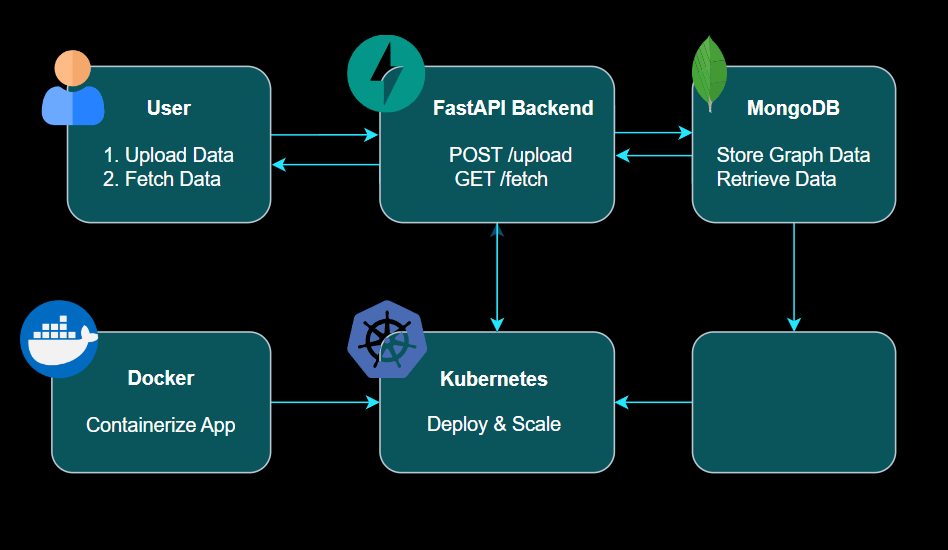

# Hierarchical Traceability Backend Solution

This project provides a Python-based backend implementation of traceability computation in hierarchical references among elements. The implementation supports upward and downward references in multiple levels, is containerized via Docker, deployed in Kubernetes, and integrated with MongoDB for data storage.

### System-Level Diagram


---


## Table of Contents

1. [Project Overview](#project-overview)
2. [Features](#features)
3. [Technologies Used](#technologies-used)
4. [Setup Instructions](#setup-instructions)
   - [Local Development](#local-development)
   - [Docker Setup](#docker-setup)
   - [Kubernetes Deployment](#kubernetes-deployment)
5. [API Endpoints](#api-endpoints)
6. [Project Methodology](#project-methodology)
7. [acknowledgments](#acknowledgments)
8. [Final Notes](#final-notes)

[//]: # (8. [License]&#40;#license&#41;)

---

## Project Overview

The goal of this project is to provide a scalable and efficient backend solution for managing hierarchical relationships between elements. The solution allows users to:

- Upload hierarchical relationship data in JSON format.
- Fetch traceability data for a specific element (upward or downward relationships).
- Store and retrieve data using MongoDB.
- Deploy the application using Docker and Kubernetes.

---

## Features

- **Upload Raw Relationship Data**: Upload hierarchical relationship data in JSON format.
- **Fetch Relationships**: Fetch traceability data for a specific element (upward or downward).
- **Data Validation**: Validate relationships to ensure they are well-formed and free of errors.
- **Containerization**: Containerize the application using Docker.
- **Kubernetes Deployment**: Deploy the application and MongoDB on Kubernetes.
- **Scalability**: Configure horizontal scaling for the backend application.

---

## Technologies Used

- **Backend**: FastAPI (Python)
- **Database**: MongoDB
- **Containerization**: Docker
- **Orchestration**: Kubernetes
- **Environment Management**: Python-dotenv
- **API Documentation**: Swagger UI (Auto-generated by FastAPI)

---

## Setup Instructions

### Local Development

1. **Clone the Repository**:
   ```bash
   git clone https://github.com/your-username/hierarchical-traceability.git
   cd hierarchical-traceability
2. **Install Dependencies**:
   ```bash
   pip install -r requirements.txt
   
3. **Set Up MongoDB**:
    - Install MongoDB locally or use Docker to run a MongoDB container.
   ```bash
   MONGODB_URI=mongodb://localhost:27017/hierarchy_db
4. **Run the Application:**
   ```bash
   uvicorn main:app --host 0.0.0.0 --port 8000 --reload
5. **Access the Application:**
   ```bash
   http://localhost:8000

### Docker Setup
1. **Build the Docker Image:**
   ```bash
   docker build -t pythondeveloperproject
2. **Run the Docker Container:**
   ```bash
   docker run -p -d 8000:8000 pythondeveloperproject

### Kubernetes Deployment
1. **Push the Docker Image to Docker Hub:**
   - Tag the Docker Image to Docker Hub Repo.
   ```bash
   docker image tag pythondeveloperproject:latest syedafraz/pythondeveloperproject:latest

   - Push Image to Docker Hub
   ```bash
   docker push syedafraz/pythondeveloperproject:latest
   
2. **Apply Kubernetes Manifests:**
   ```bash
   kubectl apply -f k8s/backend-deployment.yaml
   kubectl apply -f k8s/mongo-deployment.yaml
   kubectl apply -f k8s/backend-service.yaml
   kubectl apply -f k8s/mongo-service.yaml

3. **Access the Application:**
   ```bash
   kubectl get services
   
## API Endpoints
1. **Upload Raw Relationship Data**
   - Endpoint: POST /api/upload
   
   - Input: JSON payload representing hierarchical relationships.
   ```bash
   {  \\ valid Payload
     "graph": {
       "A": ["B"],
       "B": ["C", "D"],
       "C": [],
       "D": []
     }
   }
   
   { // Cycle detected
      "graph": {
        "A": ["B"],
        "B": ["C"],
        "C": ["A"]  
      }
   }
- Output: Confirmation of successful upload or error message.

  2. **Fetch Relationships**
  - **Endpoint:** GET /api/fetch

  - **Query Parameters:**

    - element_id: The ID of the element to trace.

    - direction: Specify whether to fetch upward or downward relationships.

     - levels: Limit the traceability to a specified number of levels (optional).\

     ```bash
     GET /api/fetch?element_id=B&direction=upward&levels=2
      
## Project Methodology
### Data Upload:
The /upload endpoint accepts a JSON payload representing hierarchical relationships. The data is validated to ensure it is well-formed and free of errors (e.g., no cycles, unique identifiers, valid parent references). The validated data is stored in MongoDB as a graph structure.

### Data Fetch:
The /fetch endpoint retrieves traceability data for a specific element. The data is fetched from MongoDB and processed to return upward or downward relationships.

### Containerization:

The application is containerized using Docker for easy deployment and scalability.

### Kubernetes Deployment:

The application and MongoDB are deployed on Kubernetes for orchestration and scaling.

### Scalability:

Horizontal scaling is configured for the backend application using Kubernetes replicas.


## Acknowledgments

   - FastAPI for the backend framework.

   - MongoDB for data storage.

   - Docker for containerization.

   - Kubernetes for orchestration.

### **Final Notes**

- Ensure that all placeholders (e.g., `your-username`, `your-dockerhub-username`) are replaced with your actual information.
- If you have additional features or specific instructions, feel free to add them to the `README.md`.

```bash
    +-----------------------------------------------------+
    |                Hierarchical Traceability            |
    |                Backend Solution                     |
    |                                                     |
    |    [FastAPI Logo]  [MongoDB Logo]  [Docker Logo]    |
    |                [Kubernetes Logo]                    |
    |                                                     |
    |                Hierarchical Graph:                  |
    |                       A                             |
    |                      / \                            |
    |                     B   C                           |
    |                        / \                          |
    |                       D   E                         |
    |                                                     |
    |                API Endpoints:                       |
    |                POST /upload                         |
    |                GET /fetch                           |
    |                                                     |
    +-----------------------------------------------------+
=======

>>>>>>> ab0d64793e4c444266f05392e3a5ed8a4ac226d7
